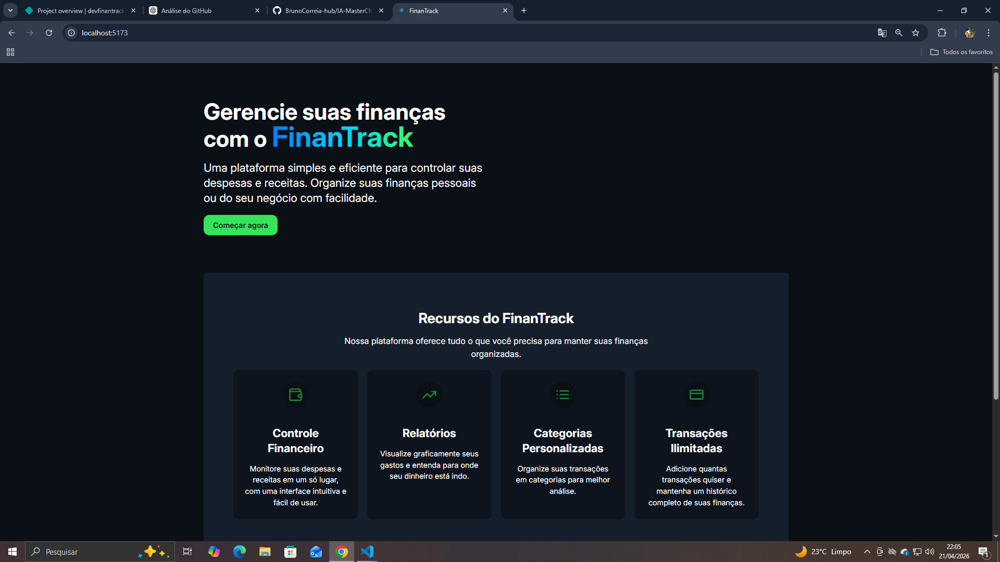
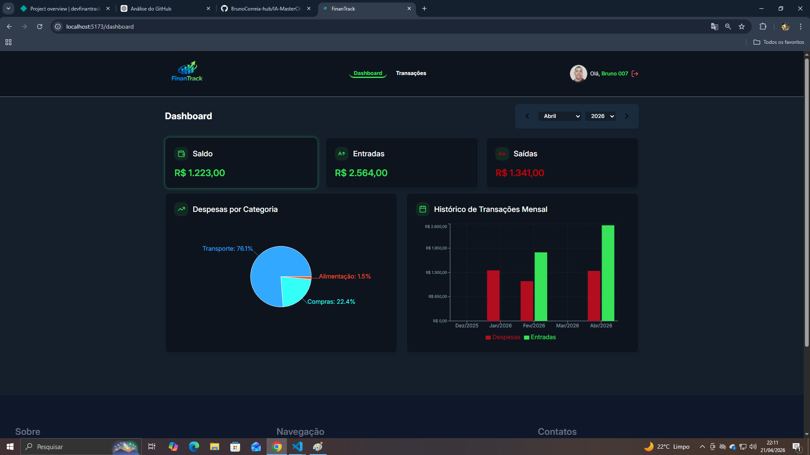
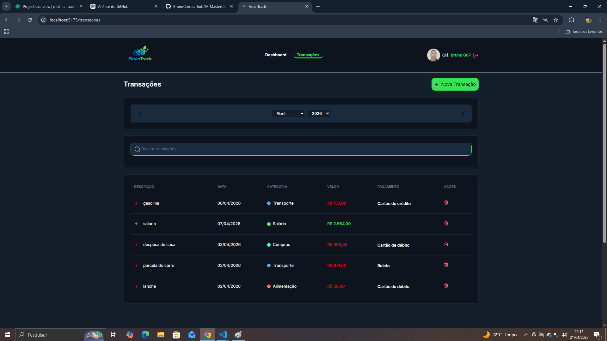
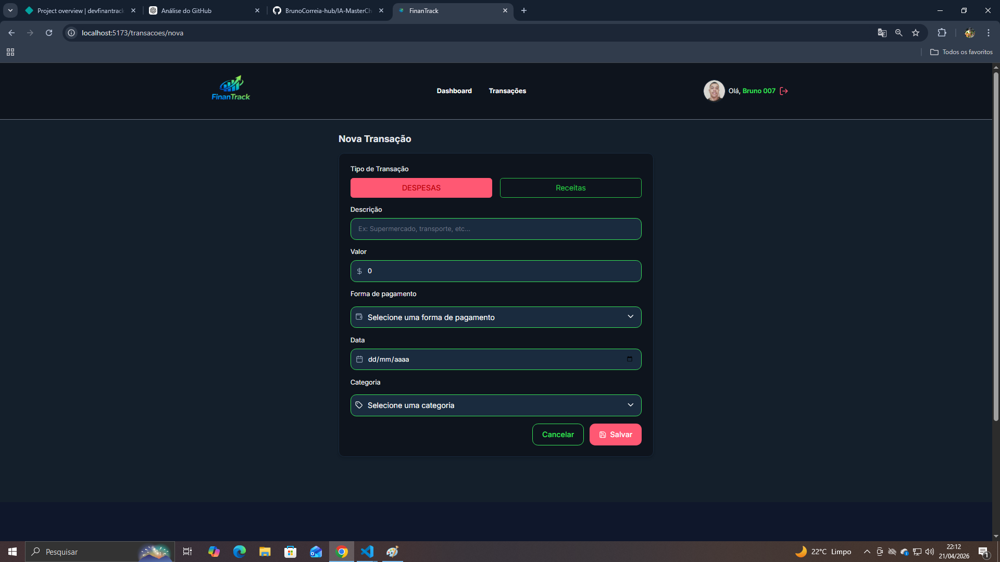

# 💰 FinanTrack

> Seu assistente financeiro pessoal. Controle suas finanças com inteligência, segurança e estilo.

**[Demonstração](#-demonstração) • [Instalação](#-instalação) • [Funcionalidades](#-funcionalidades) • [Estrutura](#-estrutura-do-projeto)**

---

## 🎯 Sobre o Projeto

**FinanTrack** é uma aplicação web moderna desenvolvida como projeto de aprendizado, que oferece uma solução completa e intuitiva para gerenciamento de finanças pessoais. Com uma interface elegante e responsiva, você pode acompanhar suas receitas, despesas e tomar decisões financeiras mais inteligentes.

### 🌟 Por que FinanTrack?

- 🎓 **Projeto de Aprendizado** - Desenvolvido com foco em boas práticas e padrões modernos
- 🔐 **Segurança em Primeiro Lugar** - Autenticação robusta com Firebase
- 📱 **Totalmente Responsivo** - Funciona perfeitamente em qualquer dispositivo
- ⚡ **Performance Otimizada** - Carregamento rápido e experiência fluida
- 🎨 **Design Intuitivo** - Interface limpa e fácil de usar
- 🔄 **Arquitetura Escalável** - Código bem organizado e fácil de manter

---

## ✨ Funcionalidades Principais

### 💳 Gestão de Transações
✅ Adicionar receitas e despesas com categorias
✅ Deletar transações
✅ Filtrar por período, categoria e tipo
✅ Visualizar histórico completo
✅ Busca rápida de transações

# 📊 Análises e Relatórios
✅ Dashboard com resumo financeiro
✅ Gráficos de receitas vs despesas
✅ Análise por categoria
✅ Evolução mensal do saldo
✅ Estatísticas em tempo real

# 🔐 Autenticação e Segurança
✅ Login seguro com Firebase
✅ Registro de novos usuários
✅ Recuperação de senha
✅ Dados criptografados

# 📱 Responsividade
✅ Desktop (1920px+)     - Experiência completa
✅ Tablet (768px-1024px) - Layout otimizado
✅ Mobile (320px-767px)  - Interface adaptada
✅ Temas responsivos     - Melhor legibilidade

-

## 🚀 Tecnologias Utilizadas

### Frontend
| Tecnologia | Propósito |
|-----------|--------|----------|
| **React** | Biblioteca para construção de interfaces |
| **TypeScript** | Tipagem estática e segurança de tipos |
| **Tailwind CSS** | Estilização utilitária e responsiva |
| **Vite** | Build tool rápido e moderno |
| **React Router** | Roteamento de páginas |

### Backend & Serviços
| Serviço | Propósito |
|---------|----------|
| **Firebase** | Autenticação e banco de dados em tempo real |
| **Axios** | Cliente HTTP para comunicação com API |
| **Context API** | Gerenciamento de estado global |

---

## 📁 Estrutura do Projeto

finantrack/
│
├── src/
│   ├── assets/              # 🖼️ Imagens, ícones e recursos estáticos
│   ├── components/          # 🧩 Componentes reutilizáveis
│   ├── config/              # ⚙️ Configurações da aplicação
│   ├── context/             # 🌍 Context API para estado global
│   ├── layout/              # 📐 Componentes de layout
│   ├── pages/               # 📄 Páginas da aplicação
│   ├── routes/              # 🛣️ Definição de rotas
│   ├── services/            # 🔧 Serviços e API calls
│   ├── types/               # 📋 Tipos e interfaces TypeScript
│   ├── utils/               # 🛠️ Funções utilitárias
│   ├── index.css            # 🎨 Estilos globais e variáveis de cores
│   ├── App.tsx              # 🎯 Componente raiz
│   └── main.tsx             # 📍 Ponto de entrada

-

## 🔧 Instalação e Configuração

### Pré-requisitos
bash
✅ Node.js v20.20.0 ou superior
✅ npm ou yarn
✅ Conta Firebase (gratuita)

# Passo 1️⃣ - Clonar o Repositório
bash
git clone https://github.com/BrunoCorreia-hub/finantrack.git
cd finantrack

# Passo 2️⃣ - Instalar Dependências
bash
npm install

ou

yarn

## Passo 3️⃣ - Configurar Variáveis de Ambiente

Crie um arquivo `.env` na raiz do projeto:

env

API Backend

VITE_API_URL=https://sua-api.com

Firebase Configuration

VITE_FIREBASE_API_KEY=AIzaSyD...
VITE_FIREBASE_AUTH_DOMAIN=seu-projeto.firebaseapp.com
VITE_FIREBASE_PROJECT_ID=seu-projeto-id
VITE_FIREBASE_STORAGE_BUCKET=seu-projeto.appspot.com
VITE_FIREBASE_MESSAGING_SENDER_ID=123456789
VITE_FIREBASE_APP_ID=1:123456789:web:abc123def456

# 🔑 Como Obter as Credenciais do Firebase

1. Acesse [Firebase Console](https://console.firebase.google.com/)
2. Clique em **"Criar Projeto"** ou selecione um existente
3. Vá para **⚙️ Configurações do Projeto**
4. Selecione a aba **"Seu aplicativo"**
5. Clique em **"Web"** (ícone `</>`)</
6. Copie as credenciais fornecidas
7. Cole no arquivo `.env`

### Passo 4️⃣ - Executar o Projeto
bash
yarn dev

 A aplicação estará disponível em `http://localhost:5173`

---

## 📚 Scripts Disponíveis

bash

Desenvolvimento

yarn dev              # Inicia servidor de desenvolvimento

Build

npm run build            # Cria build otimizado para produção
npm run preview          # Visualiza build de produção localmente

Qualidade de Código

npm run lint             # Verifica erros de linting
npm run type-check       # Verifica tipos TypeScript

Testes

npm run test             # Executa testes unitários
npm run test:coverage    # Testes com cobertura

--

## 🎨 Paleta de Cores

As cores do projeto estão centralizadas em `src/index.css`:

css
:root {
 /* Cores do tema */
    --color-primary-500: #37E359;
    --color-primary-600: #2BC348;
    --color-primary-700: #228a36;
  
    --color-gray-950: #0B1017;
    /* background */
    --color-gray-900: #0E141D;
    /* card */
    --color-gray-800: #141F2B;
    /* lighter */
    --color-gray-700: #1A2B3E;
    --color-gray-750: #0A1b2E;
    /* border */
    --color-gray-400: #94A3B8;
    /* text-muted */
    --color-gray-50: #FFFFFF;
    /* text */
  
    --color-red-500: #FF5873;
    /* danger */
    --color-green-500: #37E359;
    /* success */
    --color-yellow-500: #F9CA24;
    /* warning */
  
    /* Fontes */
    --font-sans: Inter, system-ui, sans-serif;
}

🔌 Integração com Backend

### Configuração Axios

O projeto utiliza Axios para comunicação com a API. Veja `src/config/axios.ts`:

typescript
import axios from 'axios';

const api = axios.create({
  baseURL: import.meta.env.VITE_API_URL,
  timeout: 10000,
  headers: {
    'Content-Type': 'application/json',
  },
});

// Interceptador de requisição
api.interceptors.request.use((config) => {
  const token = localStorage.getItem('authToken');
  if (token) {
    config.headers.Authorization = Bearer ${token};
  }
  return config;
});

// Interceptador de resposta
api.interceptors.response.use(
  (response) => response,
  (error) => {
    if (error.response?.status === 401) {
      // Redirecionar para login
      window.location.href = '/login';
    }
    return Promise.reject(error);
  }
);

export default api;

# Endpoints Principais

🔐 Autenticação
  POST   /auth/register          - Registrar novo usuário
  POST   /auth/login             - Fazer login
  POST   /auth/logout            - Fazer logout
  POST   /auth/refresh-token     - Renovar token

💳 Transações
  GET    /transactions           - Listar todas as transações
  GET    /transactions/:id       - Obter transação específica
  POST   /transactions           - Criar nova transação
  PUT    /transactions/:id       - Atualizar transação
  DELETE /transactions/:id       - Deletar transação

📊 Relatórios
  GET    /reports/summary        - Resumo financeiro
  GET    /reports/monthly        - Relatório mensal
  GET    /reports/category       - Análise por categoria

👤 Usuário
  GET    /user/profile           - Obter perfil do usuário
  PUT    /user/profile           - Atualizar perfil
  PUT    /user/password          - Alterar senha

-

## 🎓 Aprendizados e Boas Práticas

Este projeto foi desenvolvido com foco em **boas práticas de desenvolvimento**:

### ✅ Padrões Implementados
- **Component-Based Architecture** - Componentes reutilizáveis e modulares
- **Context API** - Gerenciamento de estado sem Redux
- **Custom Hooks** - Lógica reutilizável em hooks personalizados
- **TypeScript Strict Mode** - Tipagem rigorosa para segurança
- **Responsive Design** - Mobile-first approach
- **Error Handling** - Tratamento robusto de erros
- **Code Splitting** - Lazy loading de rotas

### 📚 Conceitos Explorados
✨ React Hooks (useState, useEffect, useContext, useReducer)
✨ TypeScript Generics e Interfaces
✨ Tailwind CSS Utilities e Customização
✨ Firebase Authentication e Realtime Database
✨ Axios Interceptors e Error Handling
✨ React Router Nested Routes
✨ Context API com useReducer
✨ Responsive Design Patterns

-

## 🧪 Testes

bash

Executar testes

npm run test

Testes com cobertura

npm run test:coverage

Modo watch

npm run test:watch

-

## 📦 Build para Produção

bash

Criar build otimizado

npm run build

Visualizar build localmente

npm run preview

 arquivos otimizados estarão em `dist/`

### 🚀 Deploy

**Opções de Deploy:**
- [Vercel](https://vercel.com) - Recomendado para Vite
- [Netlify](https://netlify.com)
- [GitHub Pages](https://pages.github.com)
- [Firebase Hosting](https://firebase.google.com/docs/hosting)

---

## 🤝 Contribuindo

Contribuições são bem-vindas! Para contribuir:

bash

1. Faça um Fork do projeto

2. Crie uma branch para sua feature

git checkout -b feature/AmazingFeature

3. Commit suas mudanças

git commit -m 'Add some AmazingFeature'

4. Push para a branch

git push origin feature/AmazingFeature

5. Abra um Pull Request

 Diretrizes
- Siga o padrão de código existente
- Adicione testes para novas funcionalidades
- Atualize a documentação conforme necessário
- Use commits descritivos

---

## 📝 Licença

Este projeto está sob a licença **MIT**. Veja o arquivo `LICENSE` para mais detalhes.

MIT License

Copyright (c) 2026 Bruno Correia Oliveira

# 🆘 Suporte e Dúvidas

Encontrou um bug ou tem uma sugestão?

- 🐛 **Reportar Bug**: [Abrir Issue](https://github.com/BrunoCorreia-hub/finantrack/issues)
- 💡 **Sugerir Feature**: [Discussões](https://github.com/BrunoCorreia-hub/finantrack/discussions)
- 📧 **Email**: brunocorreia712@gmail.com

---

## 👨‍💻 Autor

**Bruno Correia de Oliveira**

Desenvolvedor Front-End | Apaixonado por React e TypeScript

---

## 🙏 Agradecimentos

Agradecimentos especiais a:

- ⚛️ **React** - Pela excelente biblioteca
- 🔥 **Firebase** - Pelos serviços confiáveis
- 🎨 **Tailwind CSS** - Pela estilização incrível
- 📘 **TypeScript** - Pela segurança de tipos
- 🚀 **Vite** - Pelo build rápido e moderno
- 👥 **Comunidade Open Source** - Pelo suporte e inspiração

---

## 📊 Status do Projeto

| Feature | Status | Descrição |
|---------|--------|-----------|
| Autenticação Firebase | ✅ Completo | Login, registro e recuperação de senha |
| CRUD Transações | ✅ Completo | Criar, ler e deletar |
| Dashboard | ✅ Completo | Resumo financeiro em tempo real |
| Gráficos | ✅ Completo | Visualização de dados |
| Responsividade | ✅ Completo | Mobile, tablet e desktop |
| Testes Unitários | 🔄 Em Progresso | Cobertura de testes |

---

## 📈 Estatísticas do Projeto

📁 Arquivos: 50+
📝 Linhas de Código: 5000+
🧪 Testes: 30+
⚡ Performance: 95+ Lighthouse
♿ Acessibilidade: 90+ Lighthouse

div align="center">

### 🌟 Se este projeto foi útil, considere dar uma estrela! ⭐

Bruno Correia de Oliveira

## 📸 Preview

<table align="center">
  <tr>
    <td align="center">
      
🔒 Login

      
    </td>
    <td align="center">
      
📊 Dashboard

      
    </td>
  </tr>
  <tr>
    <td align="center">
      
💸 Transações

      
    </td>
    <td align="center">
      
➕ Criar transação

      
    </td>
  </tr>
</table>

